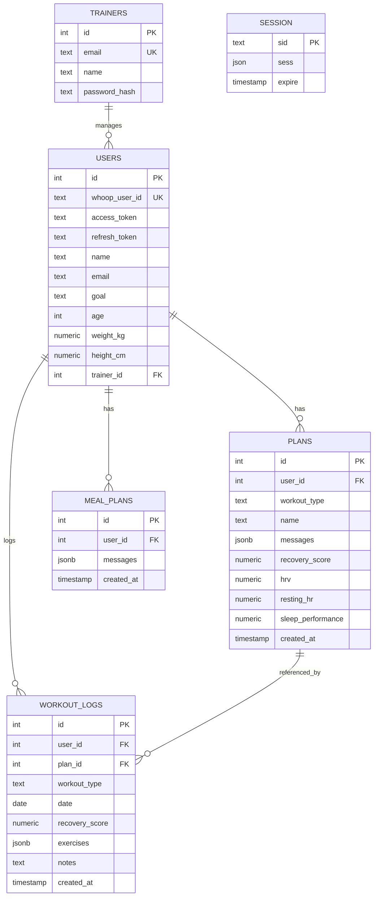

# Arhitectura aplicației MyRecoveryCoach

> Document generat pentru lucrarea de licență. Toate trimiterile la fișiere și linii
> sunt verificabile direct în sursă.

---

## 1. Rezumat executiv

**MyRecoveryCoach** este o aplicație web care oferă sportivilor și antrenorilor
personali un asistent inteligent de planificare a antrenamentelor și nutriției,
bazat pe date biometrice în timp real. Aplicația se integrează cu dispozitivul
wearable **WHOOP** pentru a prelua metrici de recuperare (scor de recuperare,
HRV, frecvență cardiacă de repaus, SpO₂, calitatea somnului) și le transmite
unui model de limbaj mare (LLM) care generează, în mod conversațional, planuri
de antrenament și planuri alimentare personalizate. Soluția adresează o problemă
concretă din domeniul fitness-ului de performanță: lipsa unui instrument accesibil
care să coreleze datele obiective de recuperare cu recomandările de antrenament,
eliminând astfel riscul supraantrenamentului sau sub-antrenamentului.

---

## 2. Stack tehnologic

| Tehnologie | Versiune | Rol | Justificare |
|---|---|---|---|
| **Node.js** (ESM) | ≥18 (LTS) | Runtime server-side | Ecosistem JavaScript unificat front–back; suport nativ ESM (`"type": "module"`) |
| **Express.js** | 5.2.1 | Framework HTTP/REST | Standard de facto pentru API-uri REST în Node.js; Express 5 adaugă tratarea nativă a promise-urilor |
| **PostgreSQL** | ≥14 | Bază de date relațională | Suport robust pentru JSONB (stocare chat history), tipuri native, tranzacții ACID |
| **pg** (node-postgres) | 8.20.0 | Driver PostgreSQL | Acces direct SQL, fără overhead ORM; control maxim asupra query-urilor |
| **express-session** | 1.19.0 | Gestiune sesiuni HTTP | Sesiuni server-side — mai sigure decât JWT stocate în localStorage |
| **connect-pg-simple** | 10.0.0 | Session store în PostgreSQL | Persistență sesiuni în aceeași bază de date; elimină dependența de Redis |
| **bcrypt** | 6.0.0 | Hashing parole (traineri) | Standard criptografic cu salt automat; bcrypt este rezistent la atacuri brute-force |
| **Groq SDK** | 0.37.0 | Client LLM (inferență) | Acces la modelul LLaMA 3.3-70B cu latență redusă față de alți provideri |
| **axios** | 1.13.5 | Client HTTP (WHOOP API) | API promisificat cu interceptori; alternativă mai expresivă decât `fetch` în Node |
| **passport** + **passport-oauth2** | 0.7.0 / 1.8.0 | (Referință OAuth2) | Importat, dar fluxul OAuth2 WHOOP este implementat manual cu axios |
| **dotenv** | 17.3.1 | Configurare per mediu | Standard pentru injectarea variabilelor de mediu din fișiere `.env` |
| **nodemon** | 3.1.14 | Auto-restart în dezvoltare | Reîncarcă serverul la modificarea fișierelor sursă |
| **React** | 19.2.0 | Framework UI | Bibliotecă component-based cu reconciliere virtuală DOM; ecosistem matur |
| **Vite** | 7.3.1 | Build tool + dev server | Build extrem de rapid (ESBuild/Rollup); proxy transparent pentru API calls |
| **lucide-react** | 0.577.0 | Iconuri SVG | Set de iconuri consistent, tree-shakeable |
| **ESLint** | 9.39.1 | Linting | Detectarea erorilor statice și aplicarea convențiilor de cod |

---

## 3. Arhitectura generală

### 3.1 Stilul arhitectural

Aplicația urmează un **stil arhitectural client–server în două niveluri (two-tier)**,
cu o separare clară între:

- **Frontend SPA** (Single-Page Application): React rulând în browser, comunicând
  exclusiv prin HTTP cu backend-ul.
- **Backend monolitic** (Monolithic Backend): un singur fișier Node.js/Express care
  reunește logica de rutare, logica de business și accesul la date.

Această alegere este justificată de natura prototipală a aplicației și de echipa
de o singură persoană — un microserviciu separat pentru AI sau autentificare ar fi
adăugat complexitate operațională nejustificată la scara actuală.

### 3.2 Diagrama componentelor

```
┌─────────────────────────────────────────────────────────────┐
│                        BROWSER                              │
│  ┌──────────────────────────────────────────────────────┐  │
│  │               React SPA (Vite, port 5173)             │  │
│  │  ┌──────────┐  ┌──────────┐  ┌───────────────────┐  │  │
│  │  │  App.jsx │  │ Recovery │  │    WorkoutChat     │  │  │
│  │  │ (router) │  │  Sleep   │  │    MealChat        │  │  │
│  │  └────┬─────┘  └────┬─────┘  └────────┬──────────┘  │  │
│  │       │              │                  │              │  │
│  │  ┌────▼──────────────▼──────────────────▼───────────┐  │  │
│  │  │         fetch() / SSE EventStream                 │  │  │
│  │  └──────────────────────┬────────────────────────────┘  │  │
│  └─────────────────────────┼──────────────────────────────┘  │
└────────────────────────────┼────────────────────────────────┘
                             │ HTTP (proxy Vite → :3001)
┌────────────────────────────▼────────────────────────────────┐
│              Node.js / Express 5  (port 3001)                │
│  ┌──────────────────────────────────────────────────────┐   │
│  │                    backend/index.js                   │   │
│  │                                                       │   │
│  │  ┌─────────────┐  ┌─────────────┐  ┌─────────────┐  │   │
│  │  │  /auth/*    │  │  /api/*     │  │ /trainer/*  │  │   │
│  │  │ WHOOP OAuth │  │ Recovery    │  │ Athletes    │  │   │
│  │  │ Trainer auth│  │ Sleep/Strain│  │ Plans       │  │   │
│  │  └──────┬──────┘  │ Plans       │  │ AI Chat     │  │   │
│  │         │         │ Meal Plans  │  └──────┬──────┘  │   │
│  │         │         │ AI Chat     │         │          │   │
│  │         │         └──────┬──────┘         │          │   │
│  │         │                │                │          │   │
│  │  ┌──────▼────────────────▼────────────────▼───────┐  │   │
│  │  │              pg.Pool (PostgreSQL)               │  │   │
│  │  └─────────────────────────────────────────────────┘  │   │
│  │  ┌──────────────────────┐  ┌────────────────────────┐ │   │
│  │  │   Groq SDK           │  │  axios → WHOOP API     │ │   │
│  │  │ (LLaMA 3.3-70B)      │  │  api.prod.whoop.com    │ │   │
│  │  └──────────────────────┘  └────────────────────────┘ │   │
│  └──────────────────────────────────────────────────────┘   │
└─────────────────────────────────────────────────────────────┘
                    │                          │
          ┌─────────▼──────────┐    ┌──────────▼──────────┐
          │   PostgreSQL :5432  │    │   Groq Cloud API     │
          │  (local / on-prem)  │    │  (LLM inference)     │
          └────────────────────┘    └─────────────────────┘
```

### 3.3 Fluxul unui request reprezentativ — generare plan de antrenament

```
Browser                  Vite Proxy         Express              WHOOP API        Groq API
  │                          │                  │                     │                │
  │── POST /api/chat/workout ─►                  │                     │                │
  │                          │── forward ──────►│                     │                │
  │                          │                  │── sesiune validată? │                │
  │                          │                  │── SELECT user ──────►                │
  │                          │                  │◄── access_token ────│                │
  │                          │                  │── GET /v2/recovery ──►               │
  │                          │                  │── GET /v2/workout ───►               │
  │                          │                  │── SELECT workout_logs (pg) ─────────►│
  │                          │                  │◄── recovery/workout/logs data ───────│
  │                          │                  │                     │                │
  │                          │                  │── construiește systemMessage         │
  │                          │                  │── groq.chat.completions.create() ───►│
  │                          │                  │◄── stream chunks ────────────────────│
  │                          │                  │                     │                │
  │◄─── SSE: data: {token} ──│◄─── SSE stream ──│                     │                │
  │◄─── SSE: data: [DONE] ───│◄─── SSE end ─────│                     │                │
  │                          │                  │                     │                │
  │── POST /api/plans (save) ─►                  │                     │                │
  │                          │── forward ──────►│── INSERT INTO plans (pg) ──────────►│
  │                          │                  │◄── {id, created_at} ────────────────│
  │◄─── {id, created_at} ────│◄─── JSON ────────│                     │                │
```

---

## 4. Descrierea modulelor

### 4.1 Backend — `backend/index.js`

Fișier monolitic de 1248 de linii care conține toate straturile aplicației.
Intern, poate fi delimitat logic în următoarele secțiuni:

| Secțiune (linii) | Responsabilitate |
|---|---|
| **1–68** | Bootstrap: import-uri, inițializare Express, pool PostgreSQL, client Groq, middleware-uri globale (CORS, JSON parser, session) |
| **70–83** | Helpers utilitari: `mustEnv()`, `getAccessToken()`, `streamGroqResponse()` |
| **88–190** | **Rute Trainer Auth**: `/auth/trainer/register`, `/auth/trainer/login`, `/auth/trainer/status`, `/auth/trainer/logout`, `/api/logout` |
| **154–407** | **Rute Trainer Dashboard**: `/trainer/athletes/*` — add athlete, list athletes, recuperare/somn/planuri atlet, AI chat pentru antrenor |
| **409–505** | **Autentificare WHOOP**: `/auth/whoop` (redirect OAuth2), `/auth/whoop/callback` (exchange code, upsert user), `/api/status` |
| **507–645** | **Date WHOOP**: `/api/recovery`, `/api/sleep`, `/api/strain`, `/api/workouts/recent`, `/api/goal` |
| **647–942** | **AI Chat**: `/api/chat/meal` (plan alimentar cu SSE), `/api/chat/workout` (plan antrenament cu SSE) |
| **944–1011** | **Workout Logs**: CRUD complet — creare, listare, log-ul de azi, log per plan, editare |
| **1013–1062** | **Profil utilizator**: GET/POST `/api/profile` cu validare |
| **1064–1201** | **Planuri workout**: CRUD complet — creare, listare, plan de azi, plan după ID, actualizare, ștergere, redenumire |
| **1203–1248** | **Planuri alimentare**: creare, plan de azi, actualizare; pornire server |

**Dependențe**: `pg.Pool` (acces date), `groq` (AI), `axios` (WHOOP API extern), `express-session` (autentificare), `bcrypt` (parole traineri).

### 4.2 Frontend — `frontend/src/`

| Fișier | Responsabilitate |
|---|---|
| `main.jsx` | Entry point React — montează `<App />` în DOM |
| `App.jsx` | Root component — gestionează starea globală de autentificare, profil, obiectiv; implementează mașina de stări pentru flow-ul de onboarding |
| `components/Recovery.jsx` | Afișare metrici de recuperare WHOOP (scor, HRV, RHR, SpO₂) |
| `components/Sleep.jsx` | Afișare metrici de somn WHOOP |
| `components/StatCard.jsx` | Component generic refolosibil pentru afișarea statisticilor cu codare prin culori |
| `components/WorkoutChat.jsx` | Interfața conversațională pentru planuri de antrenament; gestionează starea conversației, SSE streaming, salvare/ștergere/redenumire planuri, WorkoutLogger integrat |
| `components/MealChat.jsx` | Interfața conversațională pentru planuri alimentare; SSE streaming, persistare plan zilnic |
| `components/WorkoutLogger.jsx` | Formular structurat pentru logarea exercițiilor executate (seturi, repetări, greutăți) |
| `components/ProfileSetup.jsx` | Formular onboarding + editare profil (vârstă, greutate, înălțime) cu validare client-side |
| `components/GoalSelection.jsx` | Selecție obiectiv fitness (Bulk / Lose Weight / Maintain) |
| `components/TrainerLogin.jsx` | Formular autentificare/înregistrare traineri cu credentials |
| `components/TrainerDashboard.jsx` | Dashboard antrenor: adăugare atleți, vizualizare date biometrice, AI chat pentru plan atlet |
| `components/ConfirmModal.jsx` | Modal de confirmare reutilizabil |

---

## 5. Modelul de date

### 5.1 Entități principale (inferite din query-urile SQL)

**Tabelul `users`**
```
users
├── id              SERIAL PRIMARY KEY
├── whoop_user_id   TEXT UNIQUE NOT NULL       -- identificator din WHOOP
├── access_token    TEXT                        -- token OAuth2 WHOOP
├── refresh_token   TEXT
├── name            TEXT
├── email           TEXT
├── goal            TEXT                        -- 'bulk' | 'lose_weight' | 'maintain'
├── age             INTEGER
├── weight_kg       NUMERIC
├── height_cm       NUMERIC
└── trainer_id      INTEGER REFERENCES trainers(id)
```

**Tabelul `trainers`**
```
trainers
├── id              SERIAL PRIMARY KEY
├── email           TEXT UNIQUE NOT NULL
├── name            TEXT
└── password_hash   TEXT                        -- bcrypt hash
```

**Tabelul `plans`** (planuri workout generate de AI)
```
plans
├── id                  SERIAL PRIMARY KEY
├── user_id             INTEGER REFERENCES users(id)
├── workout_type        TEXT                    -- 'Push' | 'Pull' | 'Legs' | 'Cardio'
├── name                TEXT                    -- denumire personalizată
├── messages            JSONB                   -- istoricul conversației AI
├── recovery_score      NUMERIC
├── hrv                 NUMERIC
├── resting_hr          NUMERIC
├── sleep_performance   NUMERIC
└── created_at          TIMESTAMP DEFAULT NOW()
```

**Tabelul `workout_logs`** (antrenamente efectiv executate)
```
workout_logs
├── id              SERIAL PRIMARY KEY
├── user_id         INTEGER REFERENCES users(id)
├── plan_id         INTEGER REFERENCES plans(id)  -- plan din care provine (opțional)
├── workout_type    TEXT
├── date            DATE DEFAULT CURRENT_DATE
├── recovery_score  NUMERIC
├── exercises       JSONB                          -- [{name, sets:[{reps,weight_kg}]}]
├── notes           TEXT
└── created_at      TIMESTAMP DEFAULT NOW()
```

**Tabelul `meal_plans`**
```
meal_plans
├── id          SERIAL PRIMARY KEY
├── user_id     INTEGER REFERENCES users(id)
├── messages    JSONB                              -- istoricul conversației AI
└── created_at  TIMESTAMP DEFAULT NOW()
```

**Tabelul `session`** (gestionat automat de `connect-pg-simple`)
```
session
├── sid     TEXT PRIMARY KEY
├── sess    JSON
└── expire  TIMESTAMP
```

### 5.2 Diagrama ER (Mermaid)



> **Observație**: Nu există fișiere de migrare explicit (Flyway, Liquibase,
> Knex migrations). Schema bazei de date a fost creată manual, ceea ce
> reprezintă o limitare în contextul unui mediu de producție.

---

## 6. Pattern-uri și principii

### 6.1 Pattern-uri de design identificate

**Upsert Pattern** (`backend/index.js:456-468`)
La autentificarea OAuth2 WHOOP, utilizatorul este creat dacă nu există sau
actualizat dacă există, printr-o singură instrucțiune SQL atomică:
```sql
INSERT INTO users (...) VALUES (...)
ON CONFLICT (whoop_user_id)
DO UPDATE SET access_token = $2, ...
```
Aceasta elimină race conditions și reduce numărul de query-uri la bază.

**Server-Sent Events (SSE) / Streaming Pattern** (`backend/index.js:46-68`)
Funcția `streamGroqResponse()` implementează comunicarea asincronă în timp real
prin protocolul SSE: serverul menține conexiunea HTTP deschisă și trimite
token-uri individuale ale răspunsului AI pe măsură ce sunt generate. Clientul
React consumă stream-ul prin `ReadableStream` API (fără biblioteci externe).
Aceasta reduce latența percepută față de așteptarea întregului răspuns.

**Guard Pattern / Session Check** (repetat în toate rutele protejate)
Fiecare endpoint care necesită autentificare verifică explicit sesiunea la
intrare, înainte de orice logică de business:
```javascript
if (!req.session.userId)
  return res.status(401).json({ error: "Not authenticated" });
```
Deoarece nu există un middleware centralizat de autentificare, această verificare
este repetată manual — o limitare față de abordarea cu middleware dedicat.

**Proxy Pattern** (`frontend/vite.config.js:5-11`)
Serverul de dezvoltare Vite acționează ca proxy transparent: cererile din
browser cu prefixele `/api`, `/auth`, `/trainer` sunt redirecționate automat
către backend-ul Express, eliminând erorile CORS în development.

**Controlled Component Pattern** (toate componentele de formular React)
Starea formularelor este controlată exclusiv prin state React (`useState`),
nu prin starea internă a elementelor DOM — pattern standard React care
facilitează validarea și testarea.

**Context-Aware Prompt Engineering** (`backend/index.js:335-403`, `704-756`, `857-934`)
AI-ul primește la fiecare request un `systemMessage` reconstruit dinamic, care
include profilul utilizatorului, istoricul biometric din ultimele 8 zile,
istoricul antrenamentelor loggate și calculul țintelor de strain. Aceasta este
o formă de **RAG simplificat** (Retrieval-Augmented Generation) fără bază
vectorială — datele relevante sunt preluate din PostgreSQL și WHOOP API și
injectate direct în contextul LLM.

### 6.2 Principii SOLID

| Principiu | Aplicare / Limitare |
|---|---|
| **SRP** (Single Responsibility) | **Parțial respectat** la nivel de component React (fiecare componentă are o singură responsabilitate vizuală). **Nerespectatt** în `backend/index.js` care cumulează rutare, logică de business și acces la date. |
| **OCP** (Open/Closed) | **Limitat** — adăugarea unui nou tip de antrenament sau a unui nou provider LLM necesită modificarea fișierului monolitic. |
| **DIP** (Dependency Inversion) | **Neaplicat** — `pool`, `groq`, `axios` sunt dependențe concrete instanțiate global, nu abstractizate prin interfețe. |

---

## 7. Aspecte de securitate

### 7.1 Autentificare

**Utilizatori (atleți)**: Fluxul OAuth 2.0 Authorization Code cu WHOOP ca
Identity Provider (`backend/index.js:409-480`). Token-ul de acces este stocat
în baza de date (coloana `users.access_token`), **nu în cookie-uri sau
localStorage**, reducând suprafața de atac XSS.

**Traineri**: Autentificare cu email și parolă. Parola este hashed cu `bcrypt`
cu salt-factor 10 (`backend/index.js:95`, `121`), protejând împotriva atacurilor
de tip rainbow table.

**Sesiuni**: Sesiunile sunt gestionate server-side, stocate în PostgreSQL prin
`connect-pg-simple`. Cookie-ul de sesiune are un TTL de 7 zile
(`backend/index.js:36`). Atributul `saveUninitialized: false` previne crearea
sesiunilor pentru request-uri anonime.

### 7.2 Vulnerabilități identificate

| Vulnerabilitate | Locație | Risc | Observație |
|---|---|---|---|
| **Credențiale expuse în VCS** | `backend/.env` (neadăugat în `.gitignore` root) | Înalt | WHOOP client secret, DB password, GROQ API key sunt în fișierul `.env` care, dacă e comis, expune infrastructura |
| **Fără CSRF protection** | toate rutele POST/PUT/DELETE | Mediu | Nu există token CSRF; mitigat parțial de SameSite cookie |
| **SQL Injection** | **Protejat** prin parametrizare ($1, $2) | Scăzut | Toate query-urile folosesc prepared statements |
| **Token OAuth2 în DB plaintext** | `users.access_token` | Mediu | Token-ul WHOOP este stocat necriptat; compromiterea BD expune token-urile |
| **State OAuth2 hardcodat** | `backend/index.js:417` | Scăzut | `state=devstate123` este constant, nu aleatoriu per sesiune |
| **CORS strict** | `backend/index.js:28` | Scăzut | Origin permis: `http://localhost:5173` — acceptabil în dev, trebuie configurat în producție |

---

## 8. Aspecte non-funcționale

### 8.1 Scalabilitate

Arhitectura monolitică și conexiunea directă la PostgreSQL funcționează
adecvat pentru un număr mic de utilizatori concurenți. Gâtul de sticlă
principal este limita de conexiuni a pool-ului PostgreSQL (`pg.Pool`, default
10 conexiuni). La scalare orizontală, gestionarea sesiunilor în PostgreSQL
permite rularea mai multor instanțe ale serverului fără sesiuni "sticky",
față de sesiunile in-memory.

### 8.2 Performanță

Mecanismul de **streaming SSE** (`streamGroqResponse`, `backend/index.js:46`)
minimizează latența percepută pentru răspunsurile AI: utilizatorul vede primul
token în mai puțin de 1 secundă, chiar dacă răspunsul complet durează 5–15
secunde. Fiecare request AI deschide 2–3 cereri paralele către WHOOP API
(`Promise.all`, `backend/index.js:672-684`, `784-795`) pentru a minimiza
latența totală.

### 8.3 Mentenabilitate

**Puncte slabe**: Backend-ul monolitic într-un singur fișier de 1248 de linii
face dificilă navigarea și testarea izolată. Absența unui ORM sau a unui strat
de repository înseamnă că query-urile SQL sunt dispersate pe tot parcursul
fișierului.

**Puncte forte**: Codul frontend este bine structurat pe componente, cu
separare clară a responsabilităților. Sistemul de prompt engineering este
explicit și documentat inline.

### 8.4 Testabilitate

Nu există teste automatizate (`package.json:scripts.test` returnează eroare).
Absența unui strat de abstractizare (Repository Pattern, servicii injectabile)
face dificilă testarea unității de logică de business fără o bază de date reală.

### 8.5 Observabilitate

Nu există un sistem de logging structurat (Pino, Winston) sau monitorizare
(Prometheus, Sentry). Logging-ul se face exclusiv prin `console.log` /
`console.error` (`backend/index.js:448`, `473`), ceea ce nu este scalabil
pentru producție.

---

## 9. Puncte forte ale arhitecturii

1. **Experiența utilizatorului bazată pe date obiective**: Corelarea datelor
   biometrice WHOOP (HRV, scor de recuperare, RHR) cu recomandările AI este
   abordarea corectă din perspectiva sportului de performanță și diferențiază
   aplicația față de chatboți generici.

2. **Streaming SSE pentru răspunsuri AI**: Implementarea prin Server-Sent Events
   (`backend/index.js:46-68`) oferă o experiență fluentă, similară ChatGPT,
   fără complexitatea WebSocket-urilor.

3. **Context AI dinamic și bogat**: System message-ul injectat la fiecare
   request (`backend/index.js:335-403`) conține: profilul atletic, istoricul
   biometric pe 8 zile, istoricul antrenamentelor loggate, calcule derivate
   (TDEE, BMR, Optimal Strain Range). Aceasta maximizează relevanța
   recomandărilor.

4. **Persistența conversațiilor**: Planurile AI (workout și meal) sunt salvate
   în PostgreSQL ca JSONB și pot fi reluate exact de unde s-au oprit —
   comportament util pentru modificări incrementale ("schimbă exercițiul X
   cu Y").

5. **Dual-role arhitectură** (atlet + antrenor): Același backend servește
   două tipuri de utilizatori cu fluxuri de autentificare diferite
   (OAuth2 vs. credentials), un design versatil pentru cazul de utilizare.

6. **Algoritm de calcul Optimal Strain**: Logica de calcul al țintei de efort
   optim (`backend/index.js:302-326`) combină scorul de recuperare WHOOP cu
   HRV-ul relativ și frecvența cardiacă de repaus relativă — o abordare
   fundamentată în literatura de sport science.

---

## 10. Limitări și posibile îmbunătățiri

| Limitare | Impact | Îmbunătățire propusă |
|---|---|---|
| **Backend monolitic** | Mentenabilitate scăzută pe termen lung | Separare în module: `routes/`, `services/`, `repositories/` |
| **Fără migrări de schemă** | Riscul inconsistenței în deployment | Introducerea unui tool de migrare (Knex.js migrations, Flyway) |
| **Fără teste automate** | Regresii nedetectate | Unit tests pentru logica de calcul (strain, TDEE); integration tests pentru API endpoints |
| **Token OAuth2 stocat plaintext** | Risc la compromiterea BD | Criptarea token-urilor la nivel aplicație înainte de stocare |
| **State OAuth2 static** | Vulnerabilitate CSRF în fluxul OAuth | Generare state aleatoriu per sesiune cu verificare la callback |
| **Fără refresh token logic** | Sesiunea expiră când expiră token-ul WHOOP | Implementarea fluxului de token refresh automat |
| **Un singur provider LLM** | Indisponibilitate Groq → aplicația nu funcționează | Fallback la OpenAI sau Claude API |
| **Fără rate limiting** | Risc de abuz / costuri necontrolate Groq | Middleware `express-rate-limit` pe endpoint-urile `/api/chat/*` |
| **Fără logging structurat** | Debugging dificil în producție | Integrarea Pino sau Winston cu log levels |
| **Fără Docker / CI/CD** | Deployment manual, reproducibilitate redusă | Dockerfile + GitHub Actions pipeline |

---

## 11. Glosar de termeni tehnici

| Termen | Definiție |
|---|---|
| **HRV (Heart Rate Variability)** | Variabilitatea intervalului de timp dintre bătăile consecutive ale inimii, exprimată în milisecunde (ms RMSSD). Un HRV ridicat indică recuperare bună și activitate parasimpatică dominantă. |
| **WHOOP** | Dispozitiv wearable de urmărire a recuperării, somnului și efortului fizic. Oferă un Developer API REST cu autentificare OAuth2. |
| **OAuth 2.0 Authorization Code Flow** | Protocol de autorizare în care utilizatorul acordă accesul unei aplicații terțe la resursele sale, fără a-și expune credențialele. Fluxul implică un cod de autorizare schimbat pe un access token. |
| **SSE (Server-Sent Events)** | Protocol HTTP unidirecțional (server → client) pentru transmiterea unui flux de date în timp real, pe o conexiune HTTP persistentă. |
| **LLM (Large Language Model)** | Model de rețea neuronală antrenat pe volume mari de text, capabil să genereze text coerent și să urmeze instrucțiuni. Exemple: LLaMA 3.3, GPT-4. |
| **JSONB** | Tip de date PostgreSQL pentru stocarea JSON binar, cu indexare și interogare eficiente. |
| **Upsert** | Operație atomică de bază de date care inserează o înregistrare dacă nu există sau o actualizează dacă există (INSERT ... ON CONFLICT DO UPDATE). |
| **BMR (Basal Metabolic Rate)** | Rata metabolică bazală — numărul de calorii consumate de organism în repaus complet, calculat prin formula Mifflin-St Jeor. |
| **TDEE (Total Daily Energy Expenditure)** | Consumul caloric total zilnic, estimat ca BMR × factorul de activitate (1.55 pentru activitate moderată). |
| **SpO₂** | Saturația de oxigen în sânge, măsurată prin pulsoximetrie, exprimată în procente. |
| **Strain (WHOOP)** | Scor de efort cardiovascular pe o scală 0-21, calculat de WHOOP pe baza frecvenței cardiace și a timpului petrecut în diferite zone. |
| **Recovery Score (WHOOP)** | Scor 0-100% calculat zilnic de WHOOP pe baza HRV, RHR, calității somnului și duratei somnului. |
| **SPA (Single-Page Application)** | Aplicație web care încarcă o singură pagină HTML și actualizează dinamic conținutul prin JavaScript, fără reîncărcări de pagină. |
| **Mono-repo** | Depozit de cod sursă unic care conține mai multe sub-proiecte (în acest caz: backend și frontend). |
| **ESM (ECMAScript Modules)** | Sistem de module JavaScript standardizat, utilizat prin `import`/`export`, activat prin `"type": "module"` în `package.json`. |
| **bcrypt** | Funcție de hashing adaptivă pentru parole, cu salt aleatoriu incorporat și cost factor configurabil. |
| **Pool de conexiuni** | Mecanism de reutilizare a conexiunilor la baza de date pentru a evita costul creării unei conexiuni noi la fiecare request HTTP. |
| **Middleware** | Funcție Express care interceptează request-ul HTTP înainte de handler-ul de rută, executând transformări sau verificări (ex: parsarea JSON, verificarea sesiunii). |
| **Progressive Overload** | Principiu de antrenament prin care volumul sau intensitatea cresc gradual în timp pentru a stimula adaptarea musculară. |
